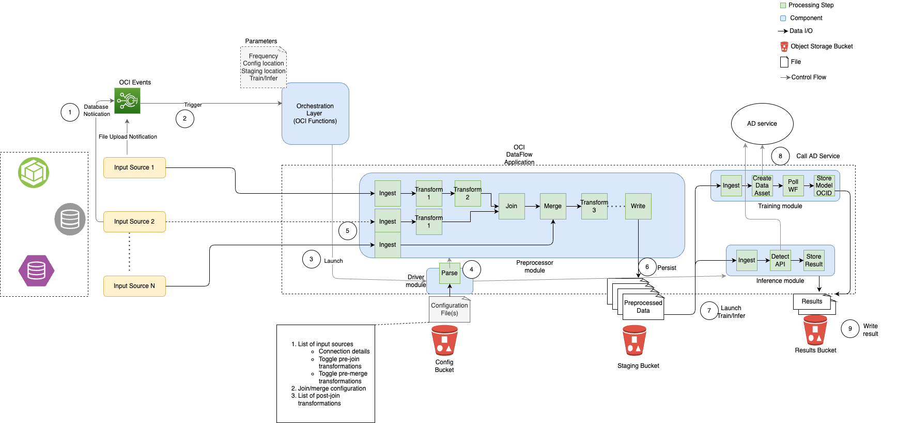

# Introduction

## About this Workshop

In this lab, we are going to offer a detailed hands-on onboarding guide for users who are interested in our automated end to end **Anomaly Detection** data preprocessing and training/inference for workflow.

## Objectives
This solution will allow you to configure a training pipeline and an inference pipeline in your tenancy, along with ingestion and preprocessing of your data. Input sizes could range from a few rows to several tens of millions of rows, and 1 column to several thousands of columns.

## Workflow introduction

A brief description of the whole picture:

1.  Prepare the driver config and upload it to the config bucket. Also create an anomaly detection (AD) application for later usage.
2.  Upload a training/inferencing dataset to the input source bucket.
3.  The upload event will trigger an event to the OCI event listening to this bucket.
4.  OCI event will trigger the downstream Orchestrator deployed on OCI Function, which will load the driver config and start the workflow.
5.  The workflow will run based on the driver config.
6.  Once the process is successful, the processed data with other informations (for example, model\_info) will be written to the staging bucket.
7.  Post processing, i.e. AD training/inferencing in our example, will begin to run. 
8.  Once post processing is done, the result will be written to the result bucket.

Notice:

*   Pipelines are triggered by changes to the input data source. For example, uploading a new training dataset into the assigned object storage bucket.
*   Our prepackaged application will execute the pipeline based on your configuration file.
    *   Once the raw data is preprocessed, the transformed data will be saved in the configured staging bucket.
    *   AD service will be triggered afterward to perform training or detection, and the results will be available in the configured results bucket
*   If you want to utilize more computational power to run the pipelines faster, this is easy to configure as well. 

### Supported Input Sources and Formats

*   We support tables stored in ATP/ADW databases
*   We support CSV/Parquet file formats in Object Storage

Note: while the pipelines are triggered by updates, they work on point-in-time snapshots of the data. We advise updating database sources in a single transaction to avoid processing data in a partial state.

### Supported Output Source and Formats

Output is always saved to Object Storage as a CSV file.

## All Tasks
* Pre-requisites
* Set up OCI Anomaly Detection
* Set up Policies
* Preparation code, config, library and datasets
* Set up OCI Data Flow
* Set up OCI Function 
* Set up OCI Events
* Running the solution end to end

## Prerequisites

This lab assumes you have:
* An Oracle Free Tier, or Paid Cloud Account.
* Understand the fundamental knowledge about cloud computing.
* Familiar with services on Oracle Cloud Infrastructure (OCI), such as Object Storage, Identity, Virtual Cloud Network, etc. 
* Familiar with data engineering, machine learning and statistics is preferred. 
* Familiar with Python (or other programming language) is strongly recommended.
* Additional prerequisites (cloud services) are mentioned per sub lab.

## Learn More

* [Introduction to all transformers](../optional/Introduction-to-Transformers-for-Data-Preprocessing.md)

## Acknowledgements
* **Author**
    * Shreyas Vinayakumar - Principal Member of Technical Staff - Oracle AI Services
    * Shujie Chen - Principal Member of Technical Staff - Oracle AI Services
    * Sudha Ravi Kumar Javvadi - Member of Technical Staff - Oracle AI Services

* **Last Updated By/Date**
    * Shujie Chen - Principal Member of Technical Staff - Oracle AI Services
