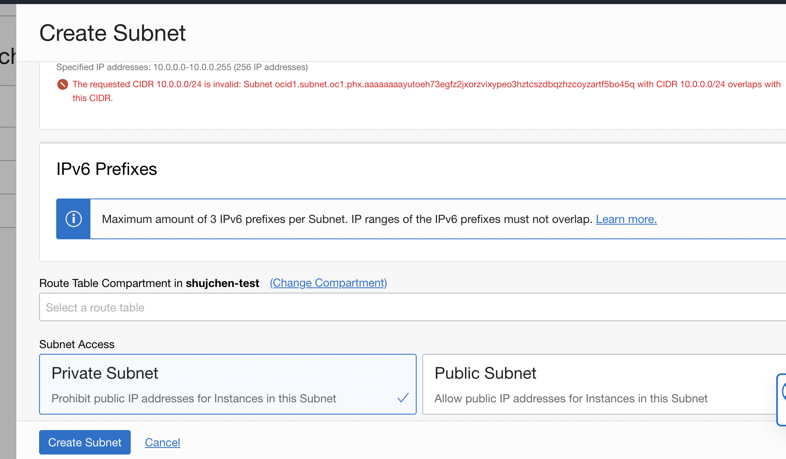
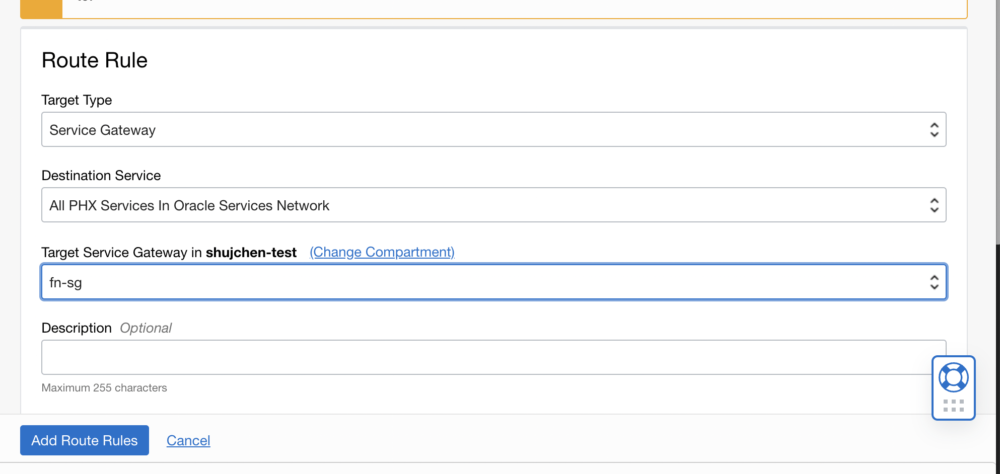

Lab 6: Setting up OCI Function
=== 

## 6.1 Setting Virtual Cloud Network

1.  Go to Virtual Cloud Network, create a **VCN**. For IPv4 CIDR Blocks. I choose to use the recommended one **10.0.0.0/16**:  
    
2.  Inside the generated VCN, generate a **subnet**. For IPv4 CIDR Block, I choose to use the recommended one **10.0.0.0/24**. For Subnet Access, if you have enough quota and choose Public Subnet, then you are done with setting up of VCN. If you don't have enough quota (most likely for most customers inside OCI), then you have to choose Private Subnet.  
    
3.  Under the VCN, create a **Service Gateway**. Remember to choose **ALL <Region> Services In Oracle Service Network** under Services:  
    
4.  Under the VCN, go to **Route Tables** and click **Default Route Table for <vcn-name>**. Choose **Add Route Rules**. Choose **Service Gateway** as the Target Type, **ALL <Region> Services In Oracle Service Network** as Destination Service, and choose your generated Service Gateway as Target Service Gateway.  
    
    

## 6.2 Setting OCI Function

Go to **Functions** → **Applications**, and Create an application below. Go to **Getting Started** and use **Cloud Shell setup**. As long as you can follow the instructions on the pad and deploy your demo function, you should invoke it successfully.


```
$ fn invoke <func-name> <app-name>
Hello, World!
```

Then you should change the function body (func.py) into the following content in the [link](https://github.com/bug-catcher/oci-data-science-ai-samples/blob/415e072962940f51dd811875386ddb2c728a3af8/ai_services/anomaly_detection/data_preprocessing_examples/oci_data_flow_based_examples/example_code/end_to_end_example/func.py).

Also update requirements.txt to the following:

 Expand source

```
fdk>=0.1.46
oci>=2.2.18
```

Finally, enable the logs under the function for troubleshooting purpose.

