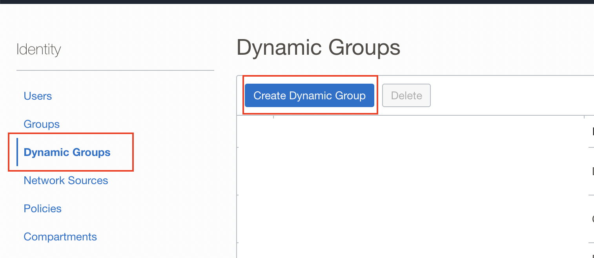

Lab 2: Setup policies
===

1.  First of all, you should have a valid compartment for all the resource mentioned below working. Get your compartment OCID.

    
2.  Go to **Governance** and **Administration** >> **Dynamic Groups** and create the following matching rule:
    
    ```
    ALL {resource.type = 'fnfunc', resource.compartment.id = '<compartment-ocid>'}
    ```
    
    
    
    
3.  Go to **Policies** and prepare all the necessary policies. For convenience, I allow any-user to access the resources. You can refine the scope by creating user groups.
        
    ```
    Allow any-user to manage objects in COMPARTMENT <compartment-name>
    Allow service faas to manage objects in COMPARTMENT <compartment-name>
    Allow any-user to use cloud-shell IN COMPARTMENT <compartment-name>
    Allow any-user to manage repos IN COMPARTMENT <compartment-name>
    Allow any-user to read objectstorage-namespaces IN COMPARTMENT <compartment-name>
    Allow any-user to manage logging-family IN COMPARTMENT <compartment-name>
    Allow any-user to read metrics IN COMPARTMENT <compartment-name>
    Allow any-user to manage functions-family IN COMPARTMENT <compartment-name>
    Allow any-user to use virtual-network-family IN COMPARTMENT <compartment-name>
    Allow any-user to use apm-domains IN COMPARTMENT <compartment-name>
    Allow any-user to read vaults IN COMPARTMENT <compartment-name>
    Allow any-user to use keys IN COMPARTMENT <compartment-name>
    Allow service faas to use dataflow-family in COMPARTMENT <compartment-name>
    Allow service faas to use apm-domains IN COMPARTMENT <compartment-name>
    Allow service faas to read repos IN COMPARTMENT <compartment-name> where request.operation='ListContainerImageSignatures'
    Allow service faas to {KEY_READ} IN COMPARTMENT <compartment-name> where request.operation='GetKeyVersion'
    Allow service faas to {KEY_VERIFY} IN COMPARTMENT <compartment-name> where request.operation='Verify'
    Allow dynamic-group <dynamic-name> to manage all-resources in compartment <compartment-name>
    allow any-user to inspect compartments in COMPARTMENT <compartment-name>
    allow any-user to inspect streams in COMPARTMENT <compartment-name>
    allow any-user to use stream-push in COMPARTMENT <compartment-name>
    allow any-user to use stream-pull in COMPARTMENT <compartment-name>
    allow  any-user to use virtual-network-family in COMPARTMENT <compartment-name>
    allow  any-user to manage function-family in COMPARTMENT <compartment-name>
    allow any-user to use ons-topic in COMPARTMENT <compartment-name>
    allow any-user to manage cloudevents-rules in COMPARTMENT <compartment-name>
    Allow any-user to use cloud-shell in compartment <compartment-name>
    Allow service dataflow to read objects in compartment <compartment-name> where target.bucket.name='staging-bucket'
    Allow service dataflow to read objects in compartment <compartment-name> where target.bucket.name='inferencing-config-bucket'
    Allow service dataflow to read objects in compartment <compartment-name> where target.bucket.name='training-config-bucket'
    Allow service dataflow to read objects in compartment <compartment-name> where target.bucket.name='output-bucket'
    ```
    
